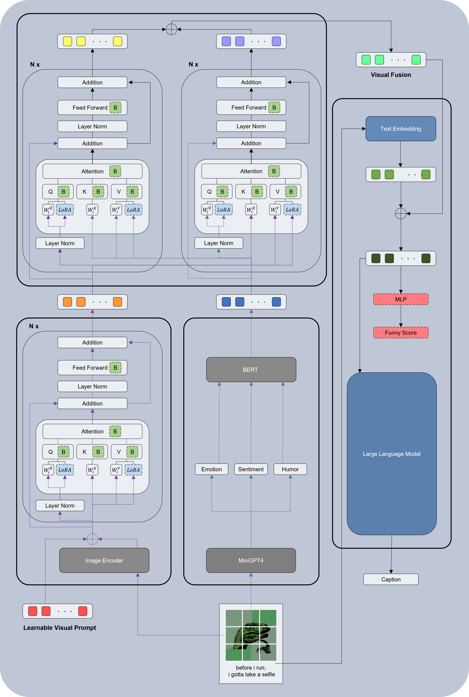

# GAMC - Adaptable Advertising Meme Caption Generation Model

## Data
### 1. Oxford_HIC
 

### 2. Instagram

* `Original_File/Home_xxx.csv` >> Instagram Post in home page (text == img alt)
* `Original_File/Done_xxx.csv` >> Instagram Post in post page (text == caption)
* `CaptionID_xxx.csv` >> Full Data with humor score
* `Filter_xxx.csv` >> Remove missing images
* `Generate_xxx.csv` >> After caption augmentation
### 3. Emotion-Sentiment-Humor Description by MiniGPT4 

## Code
### GAMC 
* Step 0 : `Preprocess` 
  * Data reformat & Augmentation: 
    * [tool.ipynb](Main/ipynb_tools/tool.ipynb)
    * [test_model.ipynb](Main/ipynb_tools/test_model.ipynb)
  * Data parsing: 
    * [parse_oxford.py](Data/Oxford_HIC/parse_oxford.py)
    * [parse_ins.py](Data/Instagram/parse_ins.py)[oxford_hic_dataset.zip](Main/oxford_hic_dataset.zip) 
  
* Step 1 : `Main model` 
  * code: [oxford_train_BLEU_minigpt4.py](Main/oxford_train_BLEU_minigpt4.py)
  * checkpoint: [checkpoint-004.pt](Main/Model/final/GAMC/20250421_oxford_3000_only1_300_82_ESH_bert_cross_concat/checkpoint-004.pt)
  
* Step 2 : `Adaptation` 
  * code: [oxford_train_BLEU_adapter_minigpt4.py](Main/oxford_train_BLEU_adapter_minigpt4.py)
  * checkpoint-MC: [checkpoint-002.pt](Main/Model/final/GAMC/MC/100up_only200_lessNotFunImg_53_171_passlength_12_MC_/all/checkpoint-002.pt)
  * checkpoint-SD: [checkpoint-011.pt](Main/Model/final/GAMC/SD/100up_only200_lessNotFunImg_169_55_passlength_10_SD_/all/checkpoint-011.pt)
  
* Step 3 : `Test result`
  * code: [oxford_predict_minigpt4.py](Main/oxford_predict_minigpt4.py)
  * organization: [result.ipynb](Main/ipynb_tools/result.ipynb)
### Evaluation
* `Humor Score` >> [humor_score.py](Main/humor_score.py)
* `Benign Score` >> Vilio  

* `Fluency Score` >> Parrot 
* `Diversity Score` >> [result.ipynb](Main/ipynb_tools/result.ipynb) (cosine similarity of image caption pairs clip embeddings)

## Framework

## Baseline
### 1. ClipCap
 

### 2. BITA 
 
  
Note: Due to the import packages, BITA can only run on linux system.
